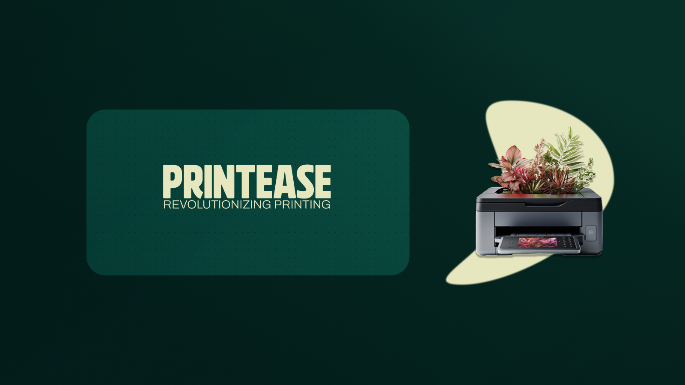

# PrintEase 🖨️ Revolutionizing Printing Services at Your Fingertips
[]()
[]()


## Idea Overview :
PrintEase is a modern full-stack web application that simplifies printing workflows for users and local print shops. With user-friendly dashboards, online file uploads, payment integration, and real-time order tracking, PrintEase bridges the digital gap in conventional printing services.

## ✨ Features Proposed: 
- 📤 Upload files and place print orders online
- 📝 Add specific print instructions (copies, color/B&W, etc.)
- 💳 Integrated payment gateway
- 📦 Track order status in real-time
- 🖥️ Admin dashboard for order management
- 🔐 Secure authentication system
- 📱 Responsive UI for all screen sizes

## ✅ Current Status : 
This repository contains the basic implementation (MVP) of the PrintEase platform.
### What has been implemented
  - Basic authentication system for user and admin roles
  - User can upload files, give print instructions, and place orders
  - Admin can view orders and update their status
  - User dashboard shows their placed orders and details
### What is part of the broader idea (yet to be added)
  - Multi-shop support and shop selection
  - Online payment integration
  - Notification system (SMS/email)
  - Mobile app version
  - Cloud storage and reprint support
  - Admin analytics dashboard

## 🧰 Tech Stack :
### Frontend
- HTML, CSS, JavaScript
- JS validation & interactivity
### Backend
- Node.js
- Express.js
- MongoDB with Mongoose
- JWT for secure authentication
- bcryptjs for password hashing

## 📸 Screenshots :
### Home Page

### Order Page

### User Dashboard

### Admin Dashboard


## Project Structure : 
printease/
├── admin/                     # Admin interface and views
├── config/                    # Configuration files (DB connection, etc.)
├── db/                        # Database initialization and utility scripts
├── models/                    # Mongoose models for Users, Orders, etc.
├── order_page/                # User-side order form and views
├── payment/                   # Payment mock handling (screenshots, logic)
├── node_modules/              # Node.js dependencies
├── .env                       # Environment variables (not committed)
├── package.json               # Backend dependencies and scripts
├── server.js                  # Entry point for the Node.js backend
└── README.md                  # Documentation (this file)

## 🚀 Prerequisites : 
Node.js (v16+) | npm | MongoDB

## Installation :
1. Clone the repository  
   ```git clone https://github.com/<your-username>/printease.git```
2. Navigate to Project folder
```cd PrintEase```
3. Install Backend Dependencies
```npm install```
4. Set up environment variables
Create a .env file in the root directory with the following content:
```MONGO_URI=your_mongodb_uri```
```JWT_SECRET=your_secret_key```
```PORT=5000```

## Running the Application :
1. Start the development server:
```node server.js```

## API EndPoints :
### Auth Roles
  - POST /api/auth/register – Register a new user
  - POST /api/auth/login – Login and receive a token
###  Order Routes
  - POST /api/orders – Place a new print order
  - GET /api/orders/user/:id – Fetch user’s orders
  - GET /api/orders/:id – Get order details
### Admin Routes
  - GET /api/admin/orders – View all orders
  - PUT /api/admin/order/:id/status – Update order status
### Payment Routes
  - POST /api/payment/upload – Upload payment screenshot
  - GET /api/payment/:orderId – Get payment information

## Security Measures
  - JWT-based authentication for session control
  - Password hashing using bcryptjs

## 🔮 Future Enhancements
  - 📱 Mobile App
  - ☁️ Cloud Storage
  - 🧾 Advanced Admin Control and User tools 
  - 📊 Shop Analytics
  - 🔔 Notification System
  - 🧩 Multi-Shop Support

## Authors : 
  - Chris Thomas Abraham
  - Vedha Mahadevan
  **- Mentor: Ms. Prathibha S Nair**

## 📜 License
- This project is licensed as **Proprietary – All Rights Reserved**. No part of this codebase may be copied, used, or modified without written permission from the authors.
- Developed as part of a micro-project at Mar Baselios College of Engineering and Technology (MBCET).
- For any use beyond that, please contact the team.
**Contact - vedhamahadevan@gmail.com | chrisevanthomas736@gmail.com**

## 🌟 Acknowledgements
  - Google Forms Survey Participants
  - Inspiration from local campus print shops
  - Thanks to our college micro-project initiative!
